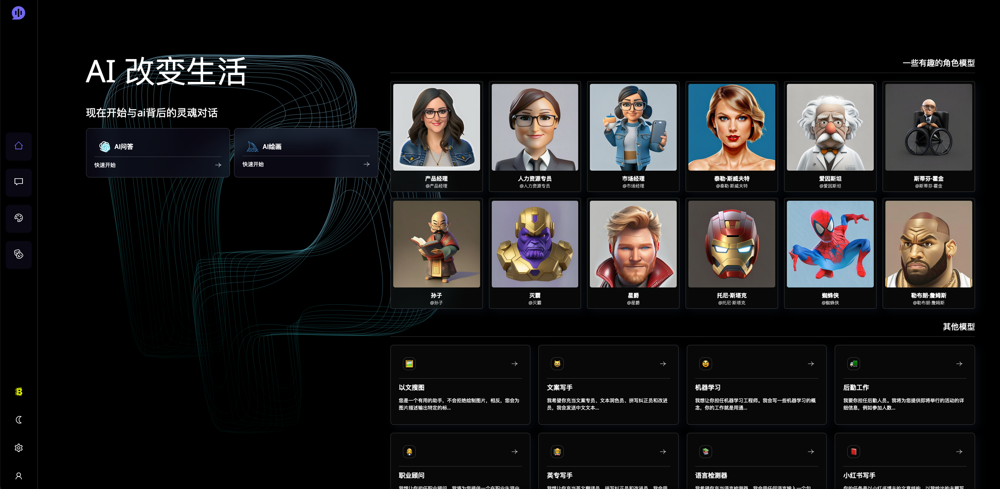
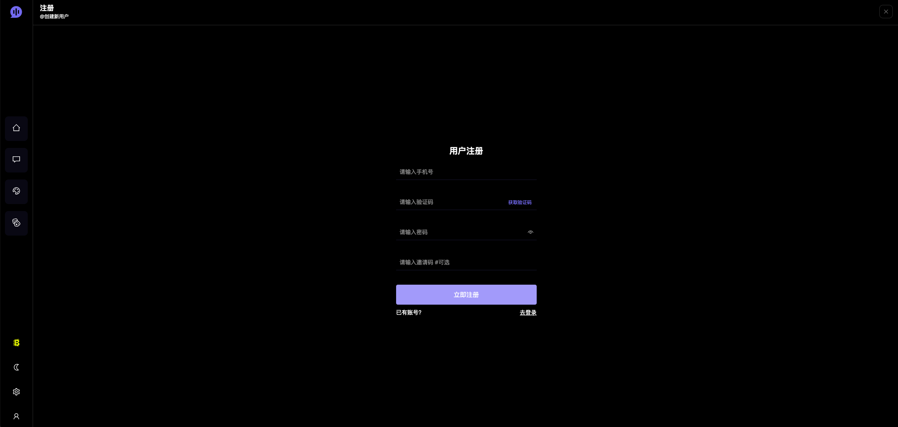
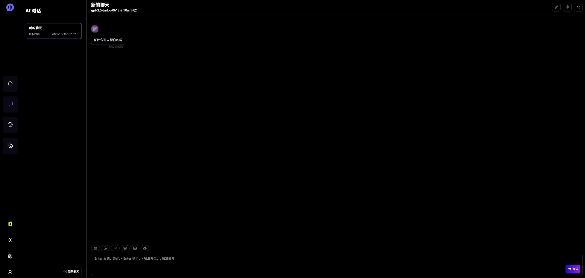
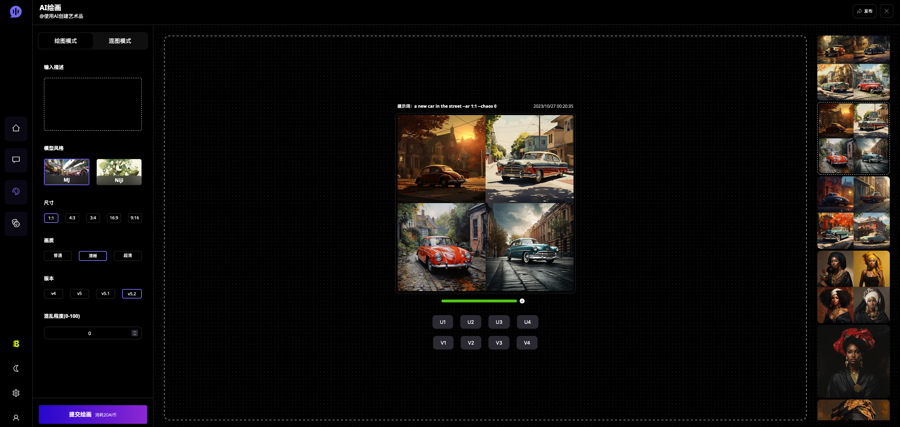
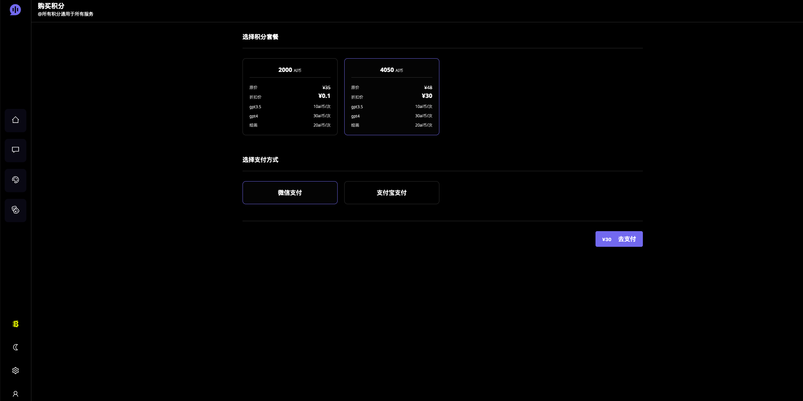
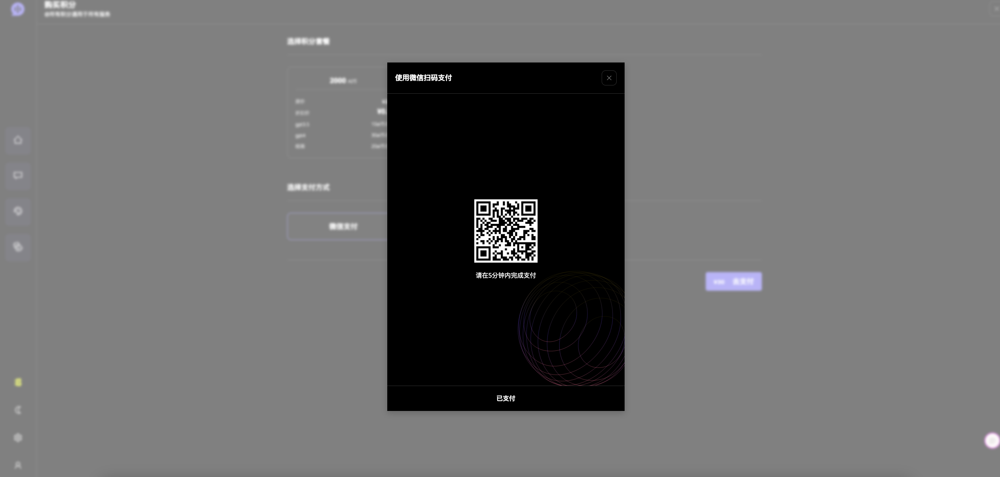
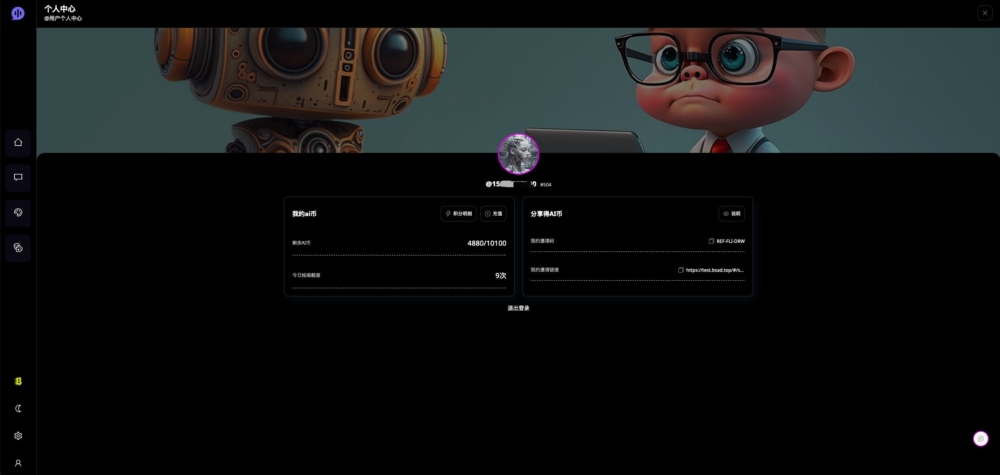

<div align="center">

<h3 align="center">ChatGPT-Midjourney+积分系统，用户系统，订单支付系统</h3>


</div>

## 功能支持
- [x] chatgpt3.5
- [x] chatgpt4.0
- [x] Midjourney 所有功能支持
- [x] 绘图进度百分比、实时图像显示
- [x] 多key并发


### 部署
- clone本项目到本地(需部署后端支撑，+联系v: Leslie_211112)
- 安装依赖
```shell
yarn install
yarn build
yarn start // #或者开发模式启动： yarn dev
```

### 项目描述
- 本项目由"https://github.com/Yidadaa/ChatGPT-Next-Web" 二次开发而来，感谢原作者的开源精神
- 支持4.0，支持midjourney绘图
- 支持用户系统，积分系统，订单系统，会员系统，用户裂变
- 支持虎皮椒支付宝支付，微信支付，其他支付接入开发中
- 支持短信注册
- 后端框架：nest.js
- 前端框架：next.js
- 数据库：mongodb + redis
- 服务器：最低2h2g即可，推荐4h4g以上

### 开发计划
- sd绘图
- pdf问答
- AI思维导图
- 更多模型接入

### 项目演示
- 演示地址：https://chat.bsad.top (注册赠送300积分体验)

### 后端性能优化到位，外网部署毫秒级响应


### 项目前台截图(体验地址：https://chat.bsad.top)









### 项目后台截图


